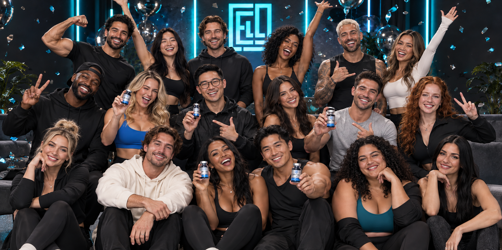
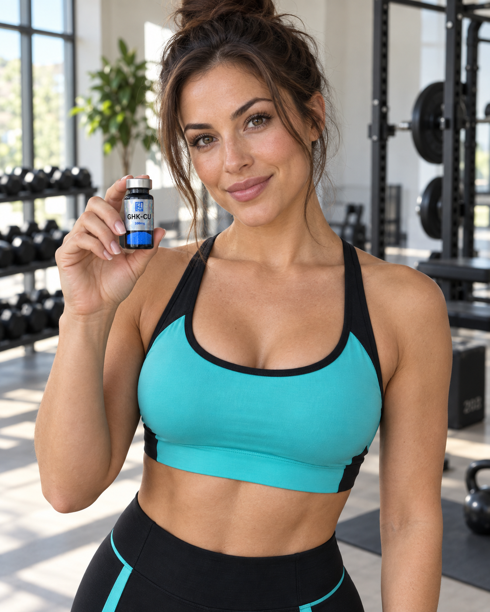
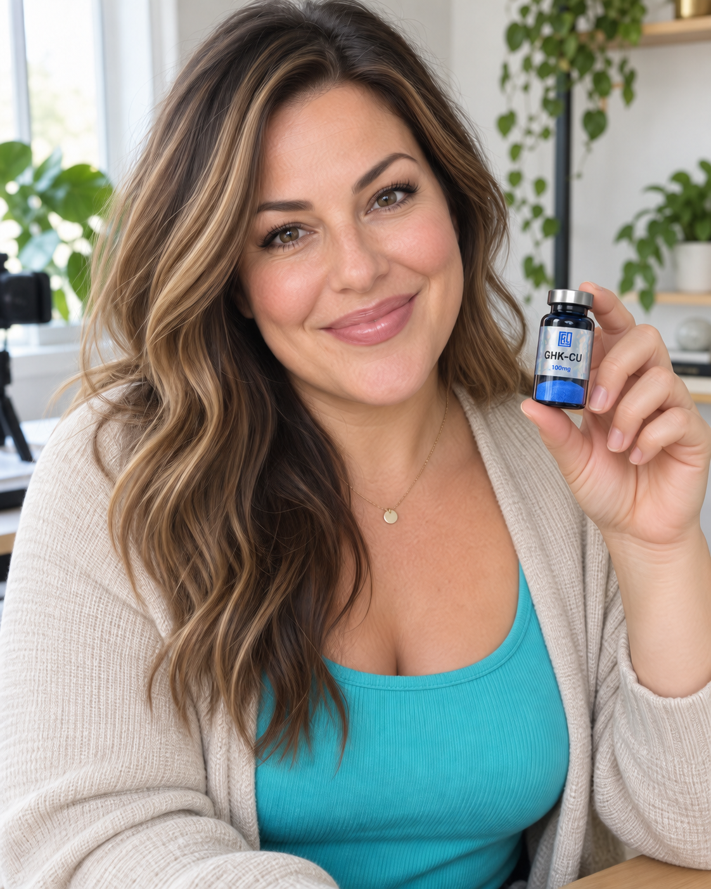
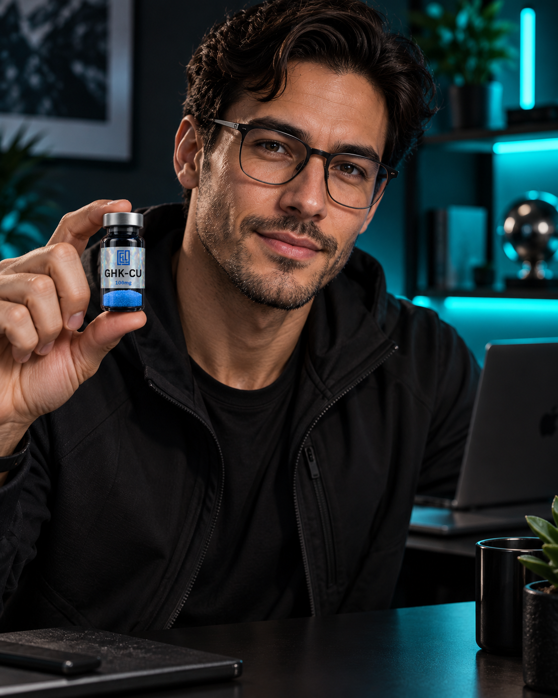
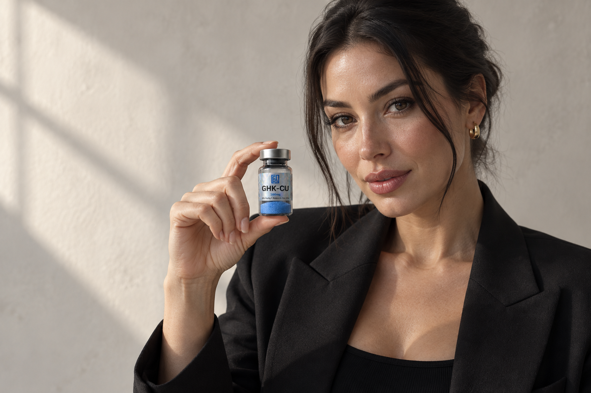
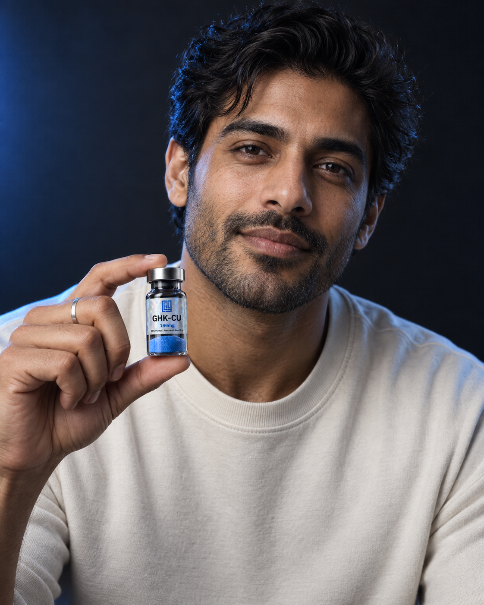

# ECL Creator Collective

Prepared 9 September 2026. The page, application intake and admin review have been implemented using **GPT-5.5**, incorporating the expanded visual direction below. The work is isolated on `codex/creator-collective`; production deployment and database activation remain separate release steps.

## Start here

- [Current confirmed offer, page messaging and program strategy](OFFER-AND-MESSAGING.md) — supersedes the earlier paid-brief offer.

- [Completed implementation, test results and preview evidence](IMPLEMENTATION.md)
- [Program, offer, complete page copy and art direction](../superpowers/specs/2026-09-09-creator-collective-design.md)
- [Approved visual update: celebratory group cover and three creator categories](../superpowers/specs/2026-09-09-creator-visual-update.md)
- [Repository-specific implementation checklist](../superpowers/plans/2026-09-09-creator-collective.md)
- [Database setup, operation and release procedure](../../storefront/docs/CREATOR-PROGRAM-OPERATIONS.md)
- [Expanded image-generation prompts and edit provenance](assets/expanded-prompts.json)
- [Image quality review and final master dimensions](assets/qa-note.md)
- [Original two-image prompt set](assets/prompts.json)
- [User-supplied visual reference manifest](references/manifest.json)

The page is **ECL Creator Collective** at `/creators`, led by **“Your influence. Our next chapter.”** and **“Apply to the collective”**. The revised design combines the store's dark shell with a celebratory 15+ creator cover, three rounded portrait panels, oversized Inter/Newsreader typography and an ivory rewards section. The dedicated category images cover fitness creators, relatable health voices and biohacking storytellers.

The confirmed offer starts with an application and fit review. Selected creators receive an eligible peptide of their choice valued up to **A$300**, then earn a **second vial after at least three agreed posts**. Successful collaborations can progress to an audience discount, referral commission and ongoing gifts/product supplies. **There is no upfront cash fee.** Rates and partner terms are agreed before activation; the earlier proposed percentages are superseded.

## Expanded campaign set

### The collective cover

Eighteen distinct fictional adults, arranged across three loose rows, with varied poses and sealed ECL vials visible among the foreground creators. The wide composition is intended to remain uncropped across responsive widths.

| Fitness creators | Everyday health voices | Biohacking storytellers |
|---|---|---|
|  |  |  |

These four masters are the primary creative set for implementation. The cover is 1774 × 887 pixels and each individual portrait is 1122 × 1402 pixels. The group includes eighteen distinct adults; the three portraits show a fitness creator, a relatable health creator at home and a biohacking creator in a studio. The cover and health portrait received targeted image-generation edits to remove unintended background wording. The two original editorial portraits below remain available for supporting sections and alternatives.

## Original alternative concepts

### Warm editorial hero

Original landscape concept: **1536 × 1024 pixels**, 2,054,410 bytes. The fictional creator wears black tailoring against a softly lit plaster background. It now supports the editorial section; the group image leads the page. Preserve her face and the vial when cropping for mobile; place web copy in HTML, not in the raster asset.

### Cool studio portrait

Portrait master for the second editorial panel: **1122 × 1402 pixels**, 2,194,738 bytes. The charcoal background and soft blue edge light echo ECL's packaging and dark store theme.

Both images were generated with the built-in image-generation tool, using the repository's `product images/GHK-CU 100mg.PNG` as the product reference. They depict fictional adults; they are not photographs of actual ECL creators, customers or endorsers. There were no stock downloads, real-influencer references or third-party account actions.

The visual review found recognisable ECL branding, readable main compound/strength text, plausible hands and sealed vial presentation. Generated fine print and exact packaging reproduction are not verified. The original PNGs remain as masters; the page uses optimized WebP derivatives under `storefront/public/images/creators`.

## Usage status

**Private concepts pending review; not cleared public advertising.** The supplied GHK-Cu artwork is in a product category addressed by current TGA guidance. Paid creative production, influencer posting, public recruitment imagery and referral commissions each need an appropriate permitted scope; changing compensation structure or using a research disclaimer does not resolve this by itself. See the sourced analysis in the design document.

The images are saved locally and the exact prompts are included for regeneration. Optimised derivatives will be integrated into the local implementation; inclusion in source is not public advertising clearance.
